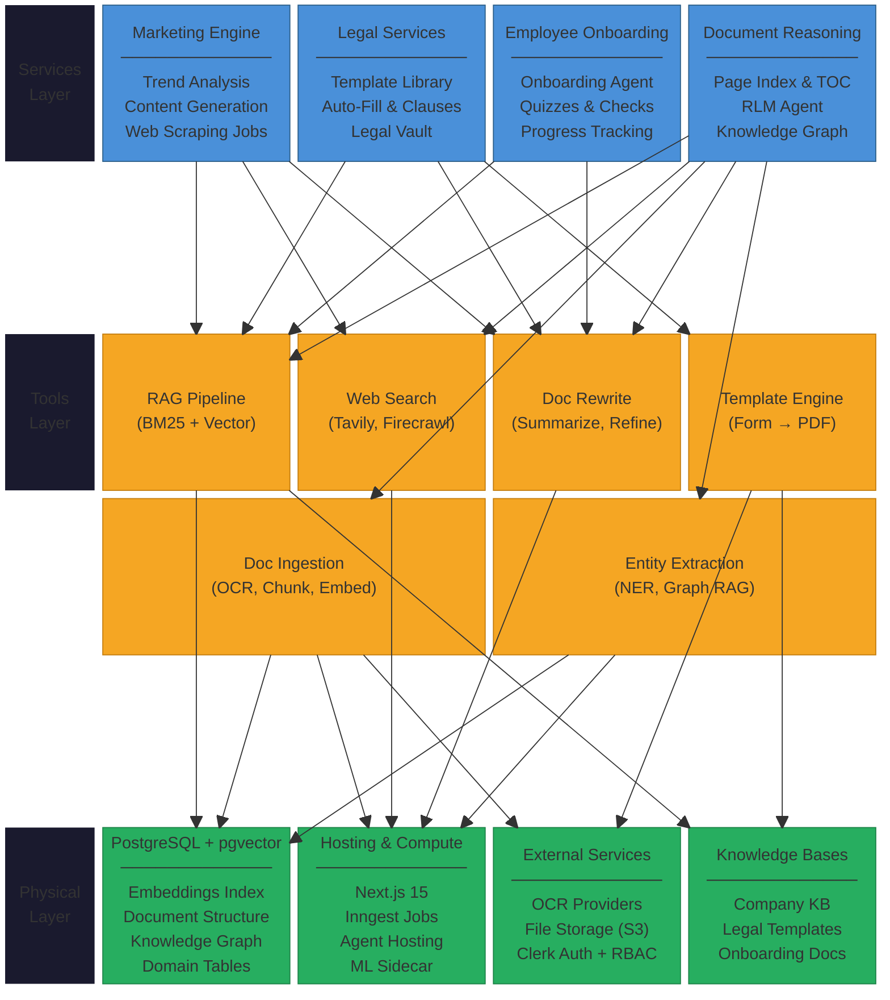

# PDR AI - Professional Document Reader AI

PDR AI is a Next.js platform for role-based document management, AI-assisted Q&A, and predictive document analysis. It combines document upload, optional OCR, embeddings, and retrieval to help teams find gaps and act faster.

##  Core Features

- Clerk-based Employer/Employee authentication with role-aware middleware.
- Document upload pipeline with optional OCR for scanned PDFs.
- PostgreSQL + pgvector semantic retrieval for RAG workflows.
- AI chat and predictive document analysis over uploaded content.
- Optional web-enriched analysis with Tavily.
- Optional reliability/observability via Inngest and LangSmith.

##  Architecture

PDR AI follows a three-layer modular architecture:



The platform is organized into:

1. **Services Layer** - Vertical business modules (Marketing, Legal, Onboarding, Document Reasoning)
2. **Tools Layer** - Reusable AI capabilities (RAG, Web Search, Document Processing, Entity Extraction)
3. **Physical Layer** - Infrastructure (PostgreSQL + pgvector, Next.js hosting, External services, Knowledge bases)

All services operate within domain-partitioned boundaries enforced by Clerk RBAC. RAG queries are scoped by `domain + company_id` to ensure data isolation.

##  Tech Stack

- Next.js 15 + TypeScript
- PostgreSQL + Drizzle ORM + pgvector
- Clerk authentication
- OpenAI + LangChain
- UploadThing + optional OCR providers
- Tailwind CSS

## Prerequisites

- Node.js 18+
- pnpm
- Docker + Docker Compose (recommended for local DB/full stack)
- Git

## ⚡ Quick Start

### 1) Clone and install

```bash
git clone <repository-url>
cd pdr_ai_v2-2
pnpm install
```

### 2) Configure environment

Create `.env` from `.env.example` and fill required values:

- `DATABASE_URL`
- `NEXT_PUBLIC_CLERK_PUBLISHABLE_KEY`
- `CLERK_SECRET_KEY`
- `OPENAI_API_KEY`
- `INNGEST_EVENT_KEY`, as placeholder

Optional integrations:
- `NODE_ENV`=development (for development, otherwise assumed to be production)
- `UPLOADTHING_TOKEN`
- `TAVILY_API_KEY`
- `INNGEST_EVENT_KEY`, `INNGEST_SIGNING_KEY`
- `AZURE_DOC_INTELLIGENCE_ENDPOINT`, `AZURE_DOC_INTELLIGENCE_KEY`
- `LANDING_AI_API_KEY`, `DATALAB_API_KEY`
- `LANGCHAIN_TRACING_V2`, `LANGCHAIN_API_KEY`, `LANGCHAIN_PROJECT`
- `DEBUG_PERF` (`1` or `true`) to enable dev perf logs for middleware and key auth/dashboard APIs

### 3) Start database and apply schema

```bash
pnpm db:push
```

### 4) Run app

```bash
pnpm inngest:dev
pnpm run dev
```

Open `http://localhost:3000`.

## 🐳 Docker Deployment Methods

### Method 1: Full stack (recommended)

Runs `db` + `migrate` + `app` via Compose:

```bash
docker compose --env-file .env --profile dev up
```

Detached mode:

```bash
docker compose --env-file .env --profile dev up -d
```

### Method 2: App container only (external DB)

Use this when your database is managed externally.

```bash
docker build -t pdr-ai-app .
docker run --rm -p 3000:3000 \
  -e DATABASE_URL="$DATABASE_URL" \
  -e CLERK_SECRET_KEY="$CLERK_SECRET_KEY" \
  -e NEXT_PUBLIC_CLERK_PUBLISHABLE_KEY="$NEXT_PUBLIC_CLERK_PUBLISHABLE_KEY" \
  -e OPENAI_API_KEY="$OPENAI_API_KEY" \
  pdr-ai-app
```

### Method 3: DB container only (host app)

```bash
docker compose --env-file .env up -d db
pnpm dev
```

For host DB tools, use `localhost:5433`.

## 🧩 How Docker Supports Platform Features

- `app` service runs auth, upload, OCR integration, RAG chat, and predictive analysis.
- `db` service provides pgvector-backed storage/retrieval for embeddings.
- `migrate` service ensures schema readiness before app startup.
- Optional providers (Inngest, Tavily, OCR, LangSmith) are enabled by env vars in the same runtime.

## 📚 Documentation

- Deployment details (Docker, Vercel, VPS): [docs/deployment.md](docs/deployment.md)
- Feature workflows and architecture: [docs/feature-workflows.md](docs/feature-workflow.md)
- Usage and API examples: [docs/usage-examples.md](docs/usage-examples.md)
- Observability and metrics: [docs/observability.md](docs/observability.md)
- **Manual testing (dev, post-PR):** [docs/manual-testing-guide.md](docs/manual-testing-guide.md)

## 🔌 API Endpoints (high-level)

- `POST /api/uploadDocument` - upload and process document (OCR optional)
- `POST /api/LangChain` - document-grounded Q&A
- `POST /api/agents/predictive-document-analysis` - detect gaps and recommendations
- `GET /api/metrics` - Prometheus metrics stream

## 🔐 User Roles

- **Employee**: view assigned documents, use AI chat/analysis.
- **Employer**: upload/manage documents, categories, and employee access.

## 🧪 Useful Scripts

```bash
pnpm db:studio
pnpm db:push
pnpm check
pnpm lint
pnpm typecheck
pnpm build
pnpm start
```

## 🐛 Troubleshooting

- Confirm Docker is running before DB startup.
- If build issues occur: remove `.next` and reinstall dependencies.
- If OCR UI is missing: verify OCR provider keys are configured.
- If Docker image pull/build is corrupted: remove image and rebuild with `--no-cache`.

## 🤝 Contributing

1. Create a feature branch.
2. Make changes and run `pnpm check`.
3. Open a pull request with test notes.

## 📝 License

Private and proprietary.

## 📞 Support

Open an issue in this repository or contact the development team.
