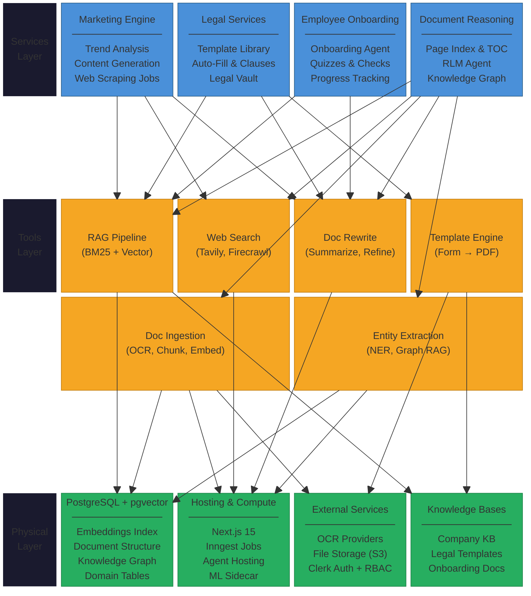

# PDR AI — Modular Architecture Overview

## Three-Layer Architecture

1. **Services Layer** — Vertical business modules
2. **Tools Layer** — Reusable AI capabilities
3. **Physical Layer** — Infrastructure, databases, hosting, storage

---

## Architecture Diagram

## Data Isolation

All services operate within domain-partitioned boundaries enforced by Clerk RBAC. RAG queries are scoped by `domain + company_id` — legal documents never surface in marketing queries.
